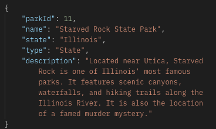
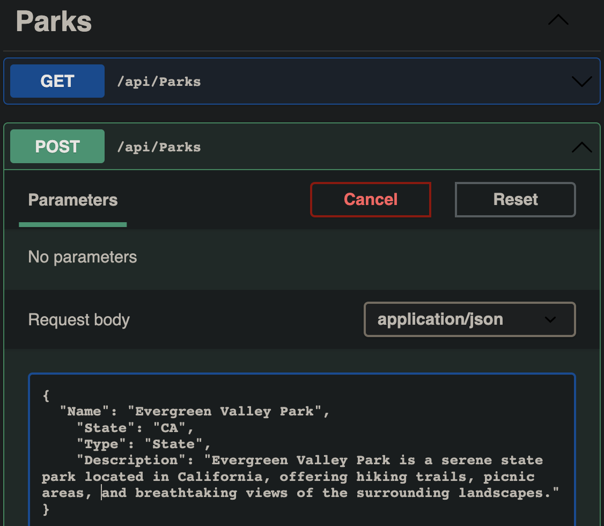

# &#x1F332; <span style="font-family: sans-serif; text-shadow: 2px 2px 4px black;">US Parks</span> &#x1F332;

### US Parks API

&nbsp;&nbsp;&nbsp;&nbsp;A simple Api that connects you to different US National & State parks.

&nbsp;&nbsp;&nbsp;&nbsp;_By_ Casey Hill

##### ....<span style="color: rgb(33, 112, 19); text-shadow: 2px 2px 4px black; font-style: italic;">_"Parks and public spaces are the antidote to a contentious world."_ - Frits van Paasschen</span>

## **Technologies Used**

-   C#
-   .NET 6
-   Entity Framework Core version 6.0
-   EFCore Design
-   EFCore Migration
-   Razor
-   MySql
-   Git
-   Swagger
-   Postman

## **Description**

A Searchable Park Api that contains a list of US National Parks and State Parks.
Use a tool like Postman or Swagger to access the Api. See below for documentation and endpoints.
<br>

## **Setup/Installation Requirements** &#x1F4BB;

<details>
<summary> Initial Setup </summary>

-   Clone this repository to your local machine.
    ```bash
    $ git clone https://github.com/0art-vandelay0/ParksApi
    ```
-   Open VS Code (or your IDE of choice).
-   Open the top level directory you just cloned.
</details>

<details>
<summary> Database Setup </summary>

-   Use a MySql RDBMS (like MySql Workbench) to import/upload the **\_\_**.sql file and create your database.
-   In your ParksApi Directory, create a file with the name `appsettings.json` and copy and past the following code into this file:

    <pre><code>{
        "Logging": {
            "LogLevel": {
            "Default": "Information",
            "Microsoft.AspNetCore": "Warning"
            }
        },
        "AllowedHosts": "*",
        "ConnectionStrings": {
            "DefaultConnection": "Server=localhost;Port=3306;parks_api;uid=[YOUR_UID];pwd=[YOUR_PASSWORD];"
        }
    }</code></pre>

-   Use your personal UID and Password for your db connection and make sure you remove the brackets currently in place.
</details>

<details>
<summary> Finish Setup </summary>

-   In your terminal:

    Change directory (cd) to ParksApi.

    ```bash
    $ dotnet build
    ```

    ```bash
    $ dotnet ef migrations add Initial
    ```

    ```bash
    $ dotnet ef database update
    ```

    ```bash
    $ dotnet run
    ```

    (or `dotnet watch run` to avoid reloading with edits in real time, and have Swagger open).

-   A web page will automatically open in your browser at port 5000 or 5001
</details>

<br>

## API

### Query Parameters

-   `name`
-   `state`
-   `type` (this is either 'State' or 'National')
-   `description`

<br>

### Endpoints

<details>
<summary><span style="color: rgb(3, 132, 252); font-style: italic;">GET</span></summary>

#### <span style="color: rgb(3, 132, 252); font-style: italic;">GET</span> /api/parks <br>

-   Returns all parks (10 responses per page)

### Query by parameter:

#### <span style="color: rgb(3, 132, 252); font-style: italic;">GET</span> /api/parks/name <br>

#### <span style="color: rgb(3, 132, 252); font-style: italic;">GET</span> /api/parks/state <br>

#### <span style="color: rgb(3, 132, 252); font-style: italic;">GET</span> /api/parks/type <br>

#### <span style="color: rgb(3, 132, 252); font-style: italic;">GET</span> /api/parks/description <br>

Search for parks by name, state, type, and description. The program will search using keyword and return any Park where the keyword is found in the parameter. <br>For example, `https://localhost:5001/api/Parks?description=murder` will return the result:


<br>
</details>

<details>
<summary><span style="color: green; font-style: italic;">POST</span></summary>
<br>
<span style="color: green; font-style: italic;">POST</span> /api/parks
<br>Create a new Park object in the body in JSON format:
<br><br>

<br><br>
</details>

<details>
<summary><span style="color: orange; font-style: italic;">PUT</span></summary>
<br>
<span style="color: orange; font-style: italic;">PUT</span> /api/parks
<br><br>
</details>
<details>
<summary><span style="color: red; font-style: italic;">DELETE</span></summary>
<br>
<span style="color: red; font-style: italic;">DELETE</span> /api/parks
<br><br>

</details>

<br>

## Debugging

<details>
<summary> If the program does not run...</summary>

-   Make sure you have the appropriate packages installed to run dotnet

    -   In your Terminal, enter the following commands:<br>
        ```bash
        $ dotnet tool install --global dotnet-ef --version 6.0.0
        ```
        ```bash
        $ dotnet add package Microsoft.EntityFrameworkCore -v 6.0.0
        ```
        ```bash
        $ dotnet add package Pomelo.EntityFrameworkCore.MySql -v 6.0.0
        ```
        ```bash
        $ dotnet add package Microsoft.EntityFrameworkCore.Design -v 6.0.0
        ```

-   To overwrite a different version of .NET to .NET 6, Try creating a `global.json` file in the Factory dir that contains the following code to override the default version, if your version exceeds .NET 6.0:<br>
    <pre><code>{
        "sdk": {
            "version": "6.0.402"
        }
    }
    </code></pre>

</details>

<br>

## **Known Bugs**

no, Parks.

<br>

Please contact [caseyfhill1@gmail.com](mailto:caseyfhill1@gmail.com?subject=Hello%20Casey,&body=Nice%20job!%20)
with any the following:

-   Found bugs &#x1F41E;
-   General Questions

## License

<details>
<summary>Copyright (c) 2023 Casey Hill</summary>
<br>
Permission is hereby granted, free of charge, to any person obtaining a copy
of this software and associated documentation files (the "Software"), to deal
in the Software without restriction, including without limitation the rights
to use, copy, modify, merge, publish, distribute, sublicense, and/or sell
copies of the Software, and to permit persons to whom the Software is
furnished to do so, subject to the following conditions:

The above copyright notice and this permission notice shall be included in all
copies or substantial portions of the Software.

THE SOFTWARE IS PROVIDED "AS IS", WITHOUT WARRANTY OF ANY KIND, EXPRESS OR
IMPLIED, INCLUDING BUT NOT LIMITED TO THE WARRANTIES OF MERCHANTABILITY,
FITNESS FOR A PARTICULAR PURPOSE AND NONINFRINGEMENT. IN NO EVENT SHALL THE
AUTHORS OR COPYRIGHT HOLDERS BE LIABLE FOR ANY CLAIM, DAMAGES OR OTHER
LIABILITY, WHETHER IN AN ACTION OF CONTRACT, TORT OR OTHERWISE, ARISING FROM,
OUT OF OR IN CONNECTION WITH THE SOFTWARE OR THE USE OR OTHER DEALINGS IN THE
SOFTWARE.
</detalis>
